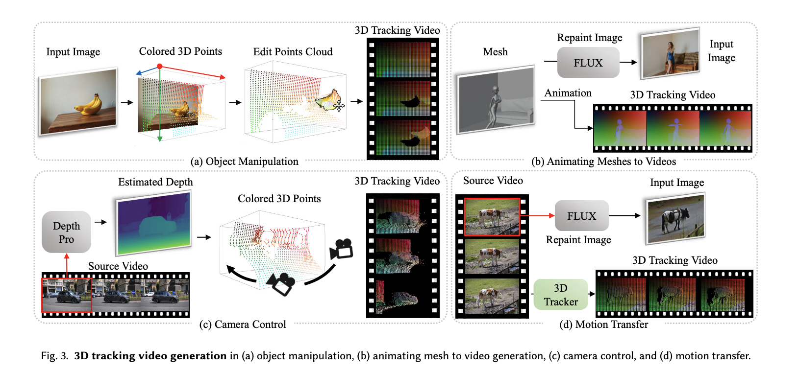
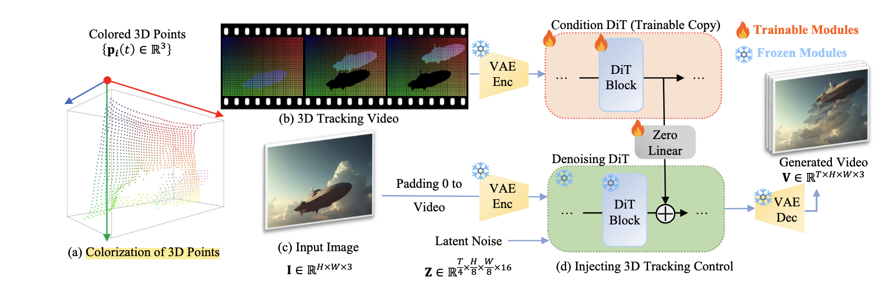
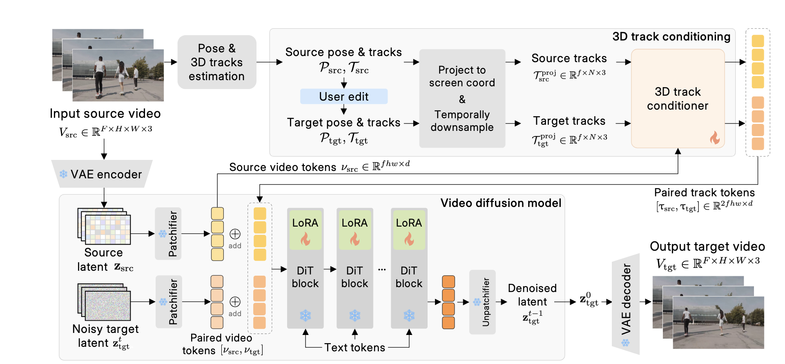
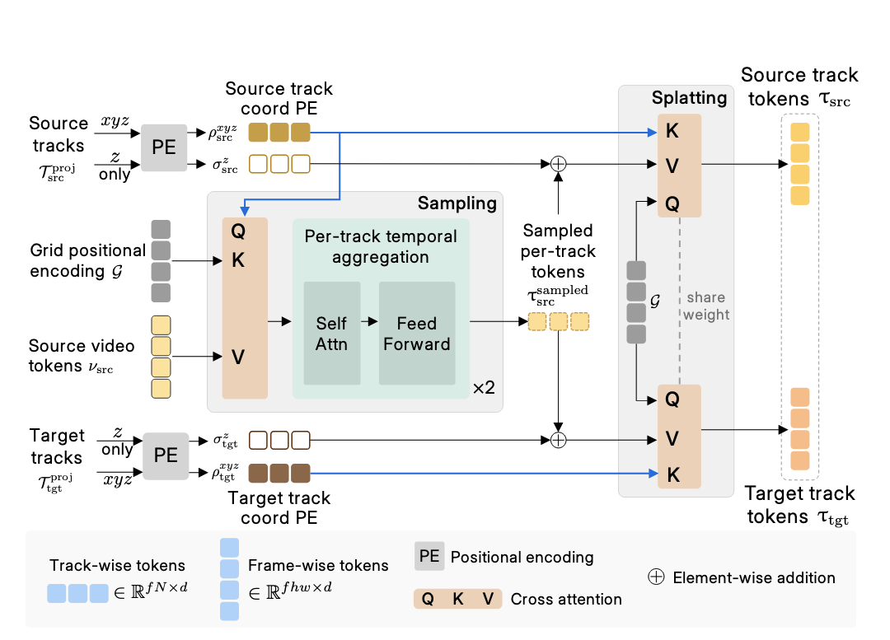

# point tracking as 3D Prior for VG

## Diffusion as Shader

以 `CogVideoX` 作为base model，然后用 Control Net 注入条件

输入是 首帧 + text + 3D Tracking 的 video

### 3D Tracking的video怎么来

讨论了几种情景



#### Object Manipulation

输入只要一个图片

=> 深度估计，得到3D的点云

=> 分割物体的点云

=> 移动物体的点云，得到 **物体点云移动的视频**

#### Animating Meshes to Videos

mesh序列

根据 `depth2image Flux` 得到首帧图片

mesh序列得到3DTracking 的video

#### Camera control

首帧图片 + 人为指定的相机轨迹

首帧图片先做深度估计，得到场景的点云

有了相机的内外参，就可以把点云投影到每一个帧的2D

#### Motion Transfer

首先有一个待迁移的视频

估计首帧的深度，然后使用 `depth 2 image Flux` 重新绘制

然后使用 `SpatialTracker` 做点云的跟踪 得到3D Tracking 的video

### 代码的实现



论文中提到

> The denoising DiT contains 42 blocks and we copy the first 18 blocks as the condition DiT

所以先copy前18个blocks

```python
self.transformer_blocks_copy = nn.ModuleList(
  [
    CogVideoXBlock(
      dim=inner_dim,
      num_attention_heads=self.config.num_attention_heads,
      attention_head_dim=self.config.attention_head_dim,
      time_embed_dim=self.config.time_embed_dim,
      dropout=self.config.dropout,
      activation_fn=self.config.activation_fn,
      attention_bias=self.config.attention_bias,
      norm_elementwise_affine=self.config.norm_elementwise_affine,
      norm_eps=self.config.norm_eps,
    ).to_empty(device="cpu")
    for _ in range(num_tracking_blocks)
  ]
)
```

同时准备对应的线性层投影

```python
self.combine_linears = nn.ModuleList(
  [nn.Linear(inner_dim, inner_dim, device="cpu") for _ in range(num_tracking_blocks)]
)

# Initialize weights of combine_linears to zero
# 对线性层做零初始化
for linear in self.combine_linears:
  linear.weight.data.zero_()
  linear.bias.data.zero_()
```

在过 `DiT` 的时候，tracking_block 和 block 有相同的架构，吃相同的输入；

最后 tracking_block 过一个线性层累加到 block的输出上

```python
if i < len(self.transformer_blocks_copy):
  if self.training and self.gradient_checkpointing:
    # Gradient checkpointing logic for tracking maps
    tracking_maps, _ = torch.utils.checkpoint.checkpoint(
      create_custom_forward(self.transformer_blocks_copy[i]),
      tracking_maps,
      encoder_hidden_states,
      emb,
      image_rotary_emb,
      **ckpt_kwargs,
    )
    else:
      tracking_maps, _ = self.transformer_blocks_copy[i](
        hidden_states=tracking_maps,
        encoder_hidden_states=encoder_hidden_states,
        temb=emb,
        image_rotary_emb=image_rotary_emb,
      )

      # Combine hidden states and tracking maps
      # controlnet 的output 过一个 Linear 再加到 hidden_states 上
      tracking_maps = self.combine_linears[i](tracking_maps)
      hidden_states = hidden_states + tracking_maps
```

## Generative Video Motion Editing with 3D Point Tracks

Task：3D Tracking 作为条件做视频编辑

下半部分应该 `easy` to understand; 主要是 3D track conditioner 的设计吧



下面是 3D track Conditioner

这里的 `z only` 是把3D 点投到了 `2D` 坐标
$$
(x,y,z)\rightarrow (u,v,z)
$$
这里的 $u$ 和 $v$ 是像素坐标 

$z$ 是深度坐标 会被normalize 到 $[0,\ 1]$ 的区间

`Grid positional encoding`  是一个和 `video tokens` 维度一致的 `tensor`

具体的 `QKV` 还是看图吧...

最后得到的是两个和原本的 video token 在维度上一致的 $[source\ track\ tokens,\ target\ track\ tokens]$  (因为`query` 是 `Grid positional encoding`)




## MolmoMotion: Forecasting Point Trajectories in 3D with Language Instruction
