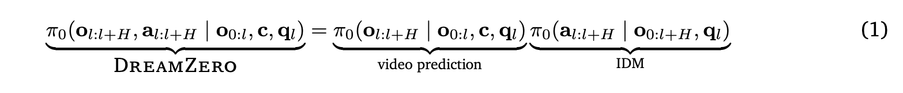

这篇笔记整理自我对 WAM 相关内容的阅读，主要是 DreamZero、World Action Models: A Survey 和 FastWAM。

我更想把它写成一份“读后梳理”，而不是论文复述。重点不是每个符号怎么推出来，而是这条路线到底在解决什么问题，以及它为什么会走到今天这一步。

## WAM 在做什么

传统的 VLA 更像是在做“根据当前观测和文本直接预测动作”。WAM 的思路更进一步：先让模型去想象未来，再从未来里把动作学出来。

这意味着模型不只是学一个动作映射，而是在学一种“未来世界表征”。这个表征可以是未来的视频，也可以是别的中间状态，但核心都是同一件事：

- 让模型对未来有更强的结构化理解
- 再利用这种未来理解去生成动作
- 尽量把动作和世界模型对齐

## DreamZero 的直觉

DreamZero 给我的第一感觉是：它本质上像一个“视频生成模型 + 逆向动力学模型”的联合体。

它的关键做法很直接：把未来视频和未来动作拼在一起，一起加噪、一起去噪。也就是说，视频 token 和 action token 共享同一个 timestep，模型在训练时同时学习两者的联合分布。

这部分可以直接写成：

$$
[x_{action}, x_{video}]
$$

在去噪时一起更新，视频和动作共享同一个 $t$。

这件事的好处是，视频和动作天然对齐，模型不会只会“想象画面”，却不知道该做什么动作。

但问题也很快出现了：

- 视频维度比动作大得多，联合去噪会很慢
- 少步生成时，视频如果还糊，动作也容易跟着不稳
- 真正做闭环控制时，实时性很难满足

于是 DreamZero 后面就出现了一个很有意思的补丁：训练模型去适应“视频模糊、动作相对清晰”的情况。这样一来，即使未来画面还不够清楚，动作也尽量能先学稳。

我对这部分的理解是，DreamZero 在尝试把“世界预测”和“动作预测”绑在一起，但它也暴露了一个事实：真正执行时，动作比画面更重要，速度比完整想象更重要。

## FastWAM 的方向

FastWAM 的思路更像是对前面路线的一次工程化收缩。

它保留了“世界模型辅助动作学习”这个训练信号，但在 inference 的时候，只保留动作生成，不再让视频分支拖慢整个链路。

FastWAM 的一个核心结构是把 `video` 和 `action` 分成两个分支，先各自过 `pre-DiT`，再在 `MoT` 里做联合 attention，之后再拆开继续各自的 `post-DiT`。

我觉得最值得记住的是它的 mask 设计：

- video 只能看自己
- action 可以看首帧和 action 序列
- inference 时，video 分支可以只跑一遍并缓存
- action 分支并不需要依赖完整的视频生成过程

这就把训练和推理分开了。

训练时，用 world modeling 当协同信号，逼动作学习和未来世界保持一致。
推理时，只保留最直接的动作路径，尽量减少视频预测带来的时间损耗。

它最后的推理目标可以写成：

$$
p_{\theta}(a_{1:H}|o,l)
$$

也就是说，inference 的时候只生成动作序列。

## 我自己的理解

这条路线给我的感觉是：

1. 训练阶段尽量把“未来”和“动作”绑紧一点
2. 推理阶段尽量把“未来视频”从动作里剥离出去
3. 真正要闭环控制时，动作质量和速度比画面完整更重要

所以 WAM 不是单纯“生成视频”，也不是单纯“预测动作”，而是在尝试把世界建模变成动作策略的一部分。

如果继续往下读，我接下来最想搞清楚的是两件事：

- 这些方法在真实机器人任务上，究竟是哪些场景最吃香
- 当 action 质量和 video 质量冲突时，模型到底是怎么平衡的

## GigaWorld-Policy

这一节我先留一个位置，后面会继续补。

## 后续会补的内容

- GigaWorld-Policy 的核心思路
- 它和 DreamZero、FastWAM 的关系
- 这些方法在真实任务里的取舍

## 参考

- DreamZero
- World Action Models: A Survey
- FastWAM
- 代码：<https://github.com/dreamzero0/dreamzero>
