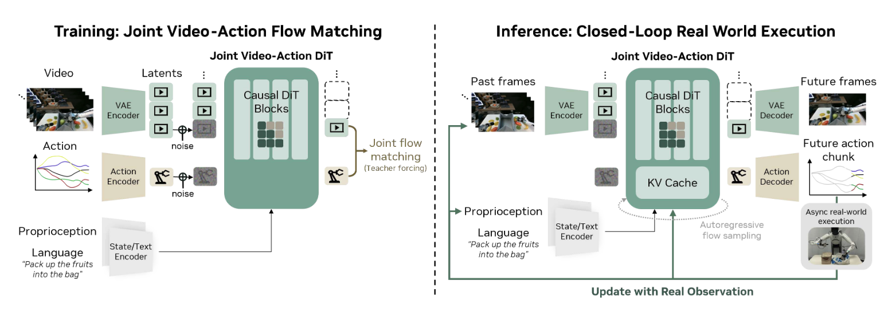
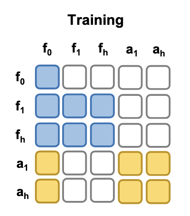
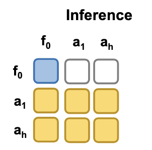
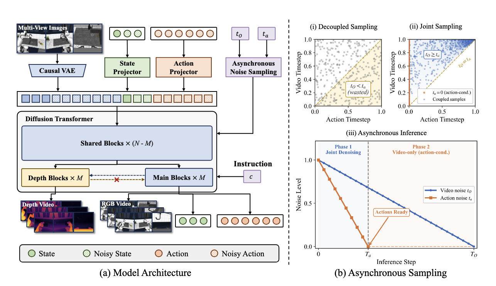
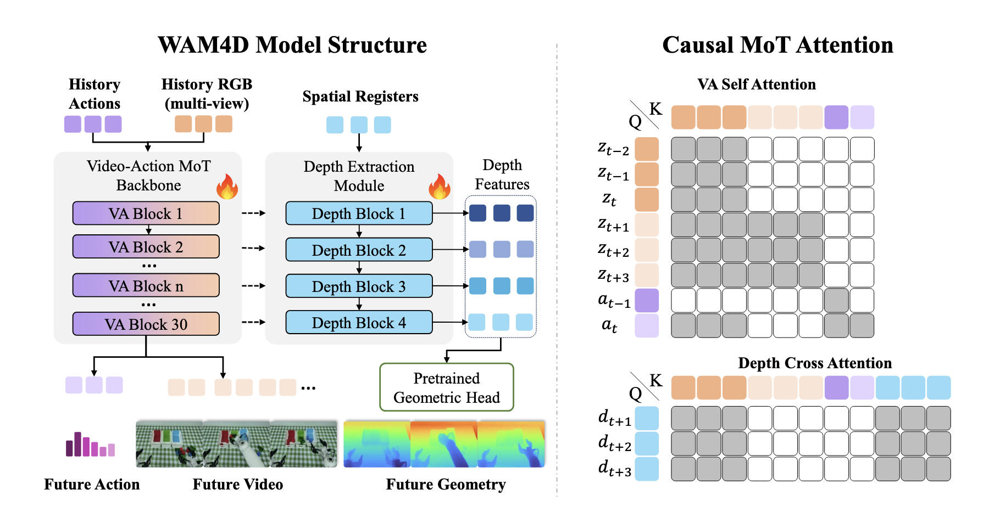
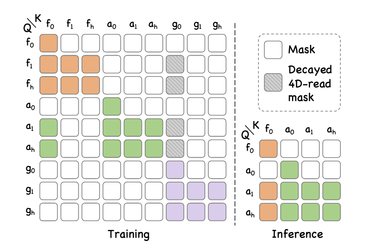

## World Action Models are Zero-shot Policies

问题在于

- 怎么对齐输出的视频和动作呢？
  - 去噪的时候同时得到 video和action，
  - $[x_{action},x_{video}]$ concat 在一起denoise出来
- 关于模型架构设计，是 bidirectional 好还是autoregressive好？
  - 使用了自回归的架构，然后一个action chunk执行完毕之后，kv cache中，使用真实的观察替换predict的kv
- diffusion有去噪的过程，如何做到实时性

实际上等价于一个视频生成模型 + 一个逆向动力学模型


img同时作为了条件和监督的目标

视频和动作共享一个 t

就模型的架构来说感觉不复杂。实际上是denoise的时候把视频和动作concat在一起了，两者使用相同的timestep；

机器人的状态 + 文本条件作为条件；其中state是拼接到 `x` 上的，但是不 attend 任何key和value，也不加噪，不解码，只是拼接在token序列中作为一个 **只读的条件**

论文后面相当大的一部分在介绍怎么提升速度，如何异步地同时进行 推理 + 动作执行

一个有趣的加速方法是，观察到时间步一样的话，模型在video模糊的时候生成的动作也不可靠

但是少步生成的时候，我们需要模型对于不清晰的视频，也能预测清晰的动作

训练模型对video和action加上不同程度的噪声，构造<视频模糊，动作清晰>的训练对；让模型学会——视频模糊的时候也能生成正确的动作

代码：https://github.com/dreamzero0/dreamzero



# World Action Models: A Survey

WAM 的特点在于，不仅仅是根据 `observation` `state` `text prompt` 预测未来的 `action` 同时需要预测未来

对于未来的预测分为以下几种形式

- pixel的预测，也就是直接decode出video
- latents-only，不解码出pixel，直接基于latents或者 flow fields, masks 预测动作
- video- generation free，不预测未来视频，而是预测一种高层的表征


# FastWAM

现有的范式：

- 联合生成 未来预测+动作序列，例如上面的 DreamZero
  - 这么做的优点是视频和动作对齐的好
  - 缺点在于比较慢，视频的维度比动作要高，其噪声可能会污染动作
- 先生成对未来的观测，然后使用IDM，基于未来观测解码出未来的动作
  - 串行执行，延迟高
  - 未来预测 visible

在 train 的时候，把 world modeling 作为一种 协同训练的信号；在inference的时候，只生成动作
$$
p_{\theta}(a_{1:H}|o,l)
$$
使用 `Wan 2.2 5B`  action expert 参数量为 `1B` 

## 代码中的实现

`video` 和 `action` 作为两个分支，分别先过 `pre_dit` 然后过一个 `mot` ; 在 `mot` 中 `video` 和 `action`  会做联合的 `attention` 

具体的mask 是这样的



左边是 `query` 上面的是 `key` 

生成的 `video` 只能对自己做 `bidirectional` 的 attention；

`action` 可以 `attend` 到 首帧 $f_0$ 和 对 action 序列做 `bidirectional` 的attention

过完 `mot` 之后 `action` 和 `video` 分开， 再来一个 `post-dit` 

`mot` 的实现：

`pre-dit` 只是为 `mot` 的attention 准备好token；

`post-dit` 只是最后投影输出目标维度的 `action`;

核心的逻辑也许都在 `mot` ：

多层的 `block` 

每一层先把 `video_expert` 和 `action_expert` 拼起来做 `attention` 

接着分开来，使用 `scale` 、 `shift` 做调制

**inference**



Video 那一支 `dit` 就只走一个pass，然后存kv cache；action dit只依赖首帧；因为在 `mot` 中，action的query只会attend**首帧**和**action序列** 所以对action的生成没有影响

# GigaWorld-Policy

使用一个统一的 model， $g_{\theta}$ 

先做动作的预测
$$
(a_{t:t+p-1},c_t)\sim g_{\theta}(o_t,s_t,l)
$$
然后预测未来的 observation
$$
(o_{t+\Delta},\cdot\cdot\cdot,o_{t+K\Delta})\sim g_\theta(o_t,s_t,l,c_t)
$$
模型架构类似 `Fast-WAM`

```python
action_stream layout: [state, action]
visual_stream layout: [ref, future]
```

使用 `MoT` (Mixture of Transformer)

以下是 build attention mask的代码

重点看 `allow_rows` 的部分

总共是4部分的tokens：

- ref：首帧，可以看 state，ref
- state：可以看state，ref
- action：可以看state，ref，action
- future：都可以看

```python
def build_mot_attention_mask(
    num_state_tokens: int,
    num_action_tokens: int,
    num_ref_tokens: int,
    num_future_tokens: int,
    batch_size: int,
    num_heads: int,
    device: torch.device,
    dtype: torch.dtype,
) -> torch.Tensor:
    """
    Causal mask for concatenated sequence [action_stream | visual_stream].

    action_stream layout: [state, action]
    visual_stream layout: [ref, future]

    Matches the interleaved [state, ref, action, future] mask semantics.
    """
    la = num_state_tokens + num_action_tokens
    lv = num_ref_tokens + num_future_tokens
    l_total = la + lv

    mask = torch.full((l_total, l_total), float("-inf"), device=device)
    ref_idx = torch.arange(la, la + num_ref_tokens, device=device)
    future_idx = torch.arange(la + num_ref_tokens, l_total, device=device)
    state_idx = torch.arange(0, num_state_tokens, device=device)
    action_only_idx = torch.arange(num_state_tokens, la, device=device)

    def allow_rows(cols: torch.Tensor, rows: torch.Tensor) -> None:
        row_grid, col_grid = torch.meshgrid(rows, cols, indexing="ij")
        mask[row_grid, col_grid] = 0.0

    state_ref_cols = torch.cat([state_idx, ref_idx])
    allow_rows(state_ref_cols, state_idx)
    allow_rows(state_ref_cols, ref_idx)

    state_ref_action_cols = torch.cat([state_idx, ref_idx, action_only_idx])
    allow_rows(state_ref_action_cols, action_only_idx)

    allow_rows(torch.arange(0, l_total, device=device), future_idx)

    return mask.unsqueeze(0).unsqueeze(0).expand(batch_size, num_heads, l_total, l_total).to(dtype=dtype)
```

| query ↓ \ key → | state | action | ref  | future |
| --------------- | :---: | :----: | :--: | :----: |
| **state**       |   ✅   |   ❌    |  ✅   |   ❌    |
| **action**      |   ✅   |   ✅    |  ✅   |   ❌    |
| **ref**         |   ✅   |   ❌    |  ✅   |   ❌    |
| **future**      |   ✅   |   ✅    |  ✅   |   ✅    |

✅ = 能 attend（mask=0），❌ = 被屏蔽（mask=-inf）

`gigaworld-policy` => `gigaworld-policy 0.5` 的提升

| 方面           | GigaWorld-Policy              | GigaWorld-Policy-0.5                 |
| -------------- | ----------------------------- | ------------------------------------ |
| 核心范式       | action-centered WAM           | 保持不变                             |
| 主干架构       | 较共享的 Transformer          | Visual Expert + Action Expert 的 MoT |
| 预训练目标     | WAM 联合训练                  | AC-WM + WAM 混合训练                 |
| 世界模型初始化 | 视频生成/world model backbone | 使用更强的 GigaWorld-1 visual prior  |
| action 推理    | 跳过未来视频                  | 专门的轻量 action-only expert 路径   |
| 调参           | 常规人工实验                  | AutoResearch 自动搜索                |
| 部署优化       | action-only decoding          | KV cache + compile + C++ runtime     |
| 4090 延迟      | 293 ms                        | 110 ms，C++ 下 85 ms                 |

这个方法是 Markovian 的，不涉及 memory 管理的问题；bidirectional 生成

方法看起来和 `FastWAM` 相似，都是训练时生成video，推理的时候 video generation free;

# MemoryWAM

| 记忆         | 保存什么           | 时间跨度   | 细节程度 | 主要作用                   |
| ------------ | ------------------ | ---------- | -------- | -------------------------- |
| 短期记忆     | 最近连续观测与动作 | 短         | 高       | 当前动作衔接与实时纠错     |
| 长期记忆     | 历史摘要、任务进度 | 长         | 低       | 维持长程任务一致性         |
| 事件边界记忆 | 子任务开始时的状态 | 跨整个事件 | 中高     | 判断事件进展、提供初始锚点 |

# 4D Guide WAM

## X-WAM（Unified 4D World Action Modeling from Video Priors  with Asynchronous Denoising）

建模多视角的 `RGBD`



### 模型的输入输出：

$$
(c,O_0,s_0)\rightarrow(O_{1:H},D_{1:H},s_{1:H},a_{1:K})
$$

### 多视角视频的处理

**代码实现**

先把 `view`  混合到 `batch` 上，namely⬇️
$$
[batch, channel, time, view, height, width]\rightarrow[batch*view,channel,time,height,width]
$$
接下来把 `T` `H` `W` 三个维度混在一起，得到 `b*v,l,d`

然后拆开 `b` 和 `v` 

对不同的view 加上位置编码，最后整合成 `b,(t,v,hw),d` 

```python
x = x.type_as(self.patch_embedding.weight)
x = self.patch_embedding(rearrange(x, "b c t v h w -> (b v) c t h w"))  # B*V, D, T, H, W
grid_sizes = list(x.shape[2:])  # [3]: THW
video_freqs = self._create_freqs(grid_sizes)

x = x.flatten(2).transpose(1, 2)
x = rearrange(x, "(b v) l d-> b v l d", v=self.num_views)

# view embeddings
with torch.amp.autocast("cuda", dtype=torch.float32):
  view_ids = torch.arange(self.num_views, device=x.device)
  view_embeddings = self.view_embedding(view_ids).view(1, self.num_views, 1, -1)  # [1, V, 1, D]
  x = x + view_embeddings
  x = rearrange(x, "b v (t hw) d-> b (t v hw) d", v=self.num_views, t=T)
```

另外两个模态 `action` `proprio` 过 `encoder` (MLP)

然后concat在一起

```python
with torch.amp.autocast("cuda", dtype=torch.float32):
  actions = self.action_encoder(actions)
  proprios = self.proprio_encoder(proprios)

  # concat as a single sequence: [B, T*V*H*W + Ta + Tp, D]
  input_seq: torch.Tensor = torch.cat([x, actions, proprios], dim=1)
    freqs = torch.cat([video_freqs, self.action_freqs[:Ta], self.proprio_freqs[:Tp]], dim=0)
```

做full-attention，没有mask 的设计

首先先跑前面的 `DiT` 层

```python
# share backbone
            for bi in range(self.num_layers - self.num_extra_layers):
                if use_ckpt:
                    input_seq = torch_checkpoint(
                        self.blocks[bi],
                        input_seq,
                        e0,
                        freqs,
                        context,
                        use_reentrant=False,
                    )
                else:
                    input_seq = self.blocks[bi](input_seq, e=e0, freqs=freqs, context=context)
```

接下来需要分叉出多个模态，这里主要是copy一份后面的block，用来生成depth

先分离出来，得到 `video token` 和对应的 timestep

```python
            extra_seq_intermediate = input_seq[:, : e.shape[1] - Ta - Tp] # get video tokens here
            extra_e0 = e0[:, : e.shape[1] - Ta - Tp] # get timestep for video
            extra_outs = [extra_seq_intermediate for _ in range(self.num_modalities - 1)]
```

接下来对于后续的 `num_extra_layers` 层

第一个 `if-else` 是走原本的主分支

对于 `for hi in range(self.num_modalities - 1):` 

是解决从分岔点分出去的若干个旁路

> 这里其实只有一个 `depth` 分支，也就是 num_modalities == 1， 这么写是为了让代码拓展性更好！

注意主分支的 `cache_kv` 会交给 `extra_blocks`

```python
for bi in range(self.num_extra_layers):
  block = self.blocks[bi + self.num_layers - self.num_extra_layers]
  if use_ckpt:
    input_seq, cache_k, cache_v = torch_checkpoint(
      partial(block, save_kv_cache=True),
      input_seq,
      e0,
      freqs,
      context,
      use_reentrant=False,
    )
    else:
      input_seq, cache_k, cache_v = block(
        input_seq, e=e0, freqs=freqs, context=context, save_kv_cache=True
      )
      for hi in range(self.num_modalities - 1):
        if use_ckpt:
          extra_outs[hi] = torch_checkpoint(
            self.extra_blocks[hi][bi],
            extra_outs[hi],
            extra_e0,
            video_freqs,
            context,
            False,
            cache_k,
            cache_v,
            use_reentrant=False,
          )
          else:
            extra_outs[hi] = self.extra_blocks[hi][bi](
              extra_outs[hi],
              e=extra_e0,
              freqs=video_freqs,
              context=context,
              cache_k=cache_k,
              cache_v=cache_v,
            )
```

extra_block 如何使用来自主干的 `kv cache`

直接把 cache 的 `K` 和 `V` 接到自己的 KV 后面

```python
def forward(self, x, freqs, save_kv_cache=False, cache_k=None, cache_v=None):
        r"""
        Args:
            x(Tensor): Shape [B, L, D] where L = T*V*HW + Ta + Tp
            freqs(Tensor): RoPE frequencies, shape [L, D / num_heads / 2]
            save_kv_cache(bool): Whether to return K/V for extra modality branches
            cache_k(Tensor): Optional cached keys [B, L', num_heads, head_dim]
            cache_v(Tensor): Optional cached values [B, L', num_heads, head_dim]
        """
        rope_q, rope_k, v = self.prepare_qkv(x, freqs)

        if cache_k is not None and cache_v is not None:
            use_k = torch.cat([rope_k, cache_k], dim=1)
            use_v = torch.cat([v, cache_v], dim=1)
        elif cache_k is not None or cache_v is not None:
            raise ValueError("cache_k and cache_v must all be None or not None")
        else:
            use_k = rope_k
            use_v = v

        x = attention(q=rope_q, k=use_k, v=use_v).flatten(2)
        x = self.o(x)

        if save_kv_cache:
            return x, rope_k, v

        return x
```


## WAM-4D

熟悉的 `MoT` 配方，主要是加了一个 depth 的分支做几何一致性的约束；正如论文中所说的

> This main video-action path follows the causal WAM formulation, while our contribution lies in attaching a training-time geometry readout to its intermediate history video features.

首先来个 learnable query tokens;

注意这个learnable tokens 预测未来 `8` 个时刻的 depth；和 `video tokens` 是在时空上对齐的

维度是 `[batch, Td, Nr, D]` 这里的 `Td = 8` ，一个 frame 的图片被patchfy 成 `Nr` 个 tokens

因为是时空对齐的，就可以给一个 **位置编码** 了

从 **`V-A MoT` 中的四个层** 取 `history video token` 加上自己 作为key
$$
R_t^{l+1}=DepthBlock_l(Q=R_t^{l},K,V=[R_t^l,Z_t^{hist,l}])
$$
如果愿意看公式的话⬆️

`R` 就是 `register token` 这里表示的是 第 `t` 个时刻的 `depth` 预测，`l` 表示这是第几层 `DepthBlock` 

经过若干个 `DitBlock` 之后，会使用 depth head预测深度；

有了预测的深度就可以和 `gt` 的深度做 pixel level 的loss了



## MECo-WAM

加入了一个几何的 `DiT`

不同在哪里？

视频和action的 `DiT` 需要先通过 `VAE` 变成 token；但是到了 几何这里，使用的是一个 `frozen VGGT encoder`

`mask` 也会有所不同了，多加了一个表征，以下是新的 `mask`



然后这个分支是 `Decayed` 的；具体表现是会以一个服从伯努利分布的概率消失，随着训练进行，消失的概率会越来越大；模型脱离4D的引导

>  初期先帮一帮扶一扶，后期放手


关于 `4d expert` 使用 `VGGT` 作为教师

4D Expert 是从零开始训练的；

4D Expert 生成的是表征，对齐 Frozen VGGT 的表征；

Loss不是算 `4D Expert` 和 `Frozen VGGT` 的表征的距离

而是算 4D Expert 对 A和B 的表征的距离 与 VGGT 对A和B的表征的距离；

同时有加权机制：和 action 相关的表征 loss 权重更大一点

## GigaWorld-Policy
